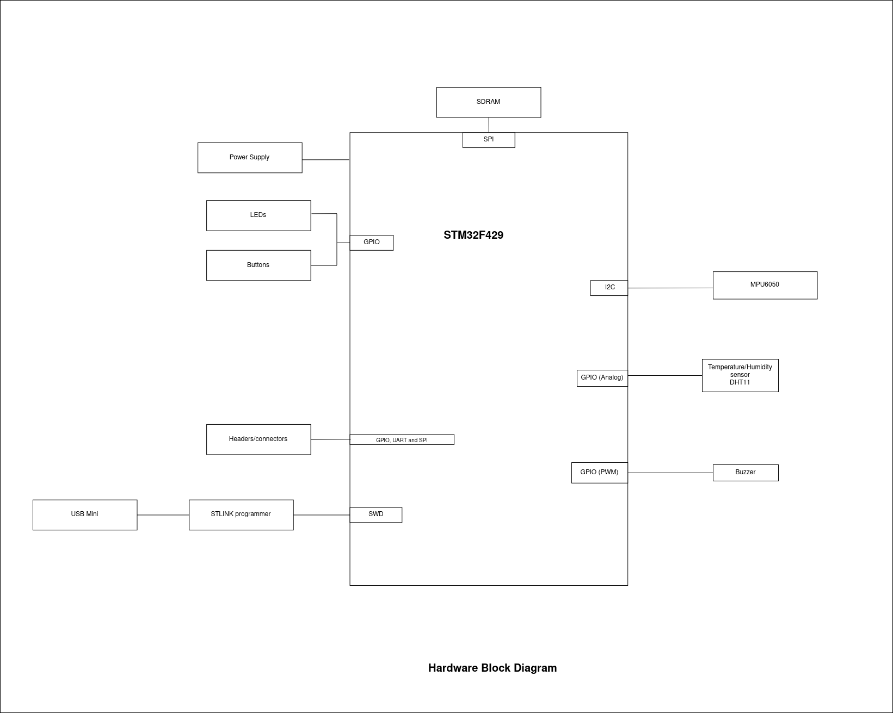

# Application Description

This project is a [smart coaster](link).
It uses IMU sensors to determine the postion of the coaster. Essentially it determines if the coaster has been moved. 
It also has temperature sensors to determine the temperature of the covered drink.
This information is then sent to a phone via a bluetooth module. A buzzer is also used to alert the user of the drink temperature and state of coaster. 
The coaster has a button to clear the buzzer sound for temperature. Leds are also used to indicate the state of the coaster.

# Hardware description

The components used to build the project are:
- STM32F4 Discovery kit. This board features a STM32F429ZIT6 MCU.
- 16x2 matrix LCD
- MPU 6050 IMU sensor
- Push button (external)
- DHT11 temperature sensor (external)
- Buzzer (external)
- LED (external)
- Lithium battery (external)
- Switch-mode power supply module (external)

The project is built around the STM32F4 Discovery kit. This board features an STM32F429ZIT6 MCU,
which is a lhigh-performance Cortex-M4 processor with a 64-Mbit SDRAM memory. 

There is a matrix LCD connected to the STM32F4 Discovery kit. This is a 16x2 LCD with a RGB backlight.
Th LCD is used to display the state of the coaster and the temperature of the drink. The parallel port is connected to the discovery kit via 
a module through the I2C1 port.

Two MPU6050 IMU sensors are connected to the STM32F4 Discovery kit. Both sensors are connected to the I2C2 port.

The DHT11 temperature/humidity sensor is connected to the discovery board via 1-wire protocol. 

To assist debugging, a command line interface on UART1 is implemented. This is used to check sensor status, and to manually test subsystems.

The buzzer is connected to the discovery kit via GPIO pin PXX. The buzzer is used to alert the user of the drink temperature and state of the coaster.

The LED is connected to the discovery kit via GPIO pin PXX. The LED is used to indicate the state of the coaster.

The push button is connected to the discovery kit via GPIO pin PXX. The push button is used to clear the buzzer sound for temperature threshold alerts.

A lithium battery connected to a switch mode power supply module powers the entire project.

# Software description

From lessons learned in class, software is architected as follows:
- The main program is written in C.
- Very liberal use of STM32 HAL libraries.
- Use of the STM32CubeMX tool for project configuration.

I ported adafruit libraries for MPU6050 IMU, 16x2 matrix LCD display and DHT11 temperature/humidity sensors. To reduce bloat, I removed functionalities that I did not need.
For example, in the MPU6050 IMU library, I needed just the gyroscope. 

I made use of a lot of interrupts. The push button generates an interrupt that  clears the buzzer sound for temperature threshold alerts. The gyroscope from the MPU6050 generates an interrupt that indicates the state of the coaster.

# Build instructions
The project is built using the STM32CubeMX tool. I also used the STM32CubeIDE to build and debug the project.
The project is on github, to build the project, clone the repository and save the downloaded repository as a STM32CubeIDE workspace on your computer.
The code can be opened as an STM32 project and be built. Everything should work, so far there's consistency between the HAL libraries. The IDE will prompt you to download the correct HAL library if there's a mismatch.

The hardware block diagram and circuit diagram are in the project folder. They show how to connect the hardware components to the project.

# Future Plans
I plan on building a more polished version of the project. Might even do a small production run.
To make this possible, I expect to switch to a different microcontroller. Preferably a low-power STM32 MCU with BLE or WiFi capabilities integrated.

Rather than alerts from buzzers and LEDs, I'd like to send notifications to a smartphone, hence, the need for BLE or Wifi.
The app would be a web app/mobile app that would allow the user to select the drink temperature thresholds and the type of alarm to be generated for the coaster state.

A nice looking enclosure for the project would be a good idea. Considering using a mix of wood and plastic for the enclosure, I'd like to try out a few different materials.
Also, the LCD will be changed into a smaller tft-lcd screen.

